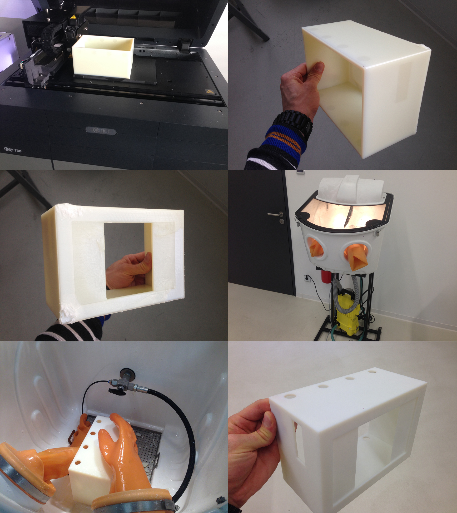

# StorageSystem
[](https://github.com/timgrossmann/StorageSystem/blob/master/LICENSE)
[](http://www.javafxtutorials.com/whatisjavafx/)
[](https://www.raspberrypi.orgx/)

##Personal Stock Control System

>Don't you know the struggle with going to the grocery store and only then realizing you forgot to check what you still got at home and what you should buy.
I had this problem quite often and ended up buying the stuff i already had, which led to me having 10 bottles of ketchup in my basement. The worst of it is, that i nearly always forgot to buy the stuff i needed. This ended up with me having to go for a second ride.
<br />For a guy living in a <b>rural area</b> this is more than annoying.


## Features
- [x] Keep track of the products in stock
- [x] Add and Remove products by scanning their barcode
- [x] Print an overview of the products in stock with your default printer
- [x] Print a shopping list with all the products 0 left in stock
- [x] Built for RaspberryPi Model3
- [x] Pretty low cost system for your household
- [x] 3D printfile of the case 


## Description
This is a "small" personal project where i'll use Java, JavaFX, the Gson-Libary, Apache-Web-Server, JSON-server and Outpan.com as Barcode libary to fix this problem for me. 
<br /><b>You can keep track of the items you have, the ones that are running out and the ones that are already empty.
You can print out an overview of the stocks or a list of items that are already out of stock.
If you're on the go, you can VPN into your home network and check which item and how many of them are still in stock.</b>

I'll try to keep the setup costs as low as possible, so it'll be a system everyone can build.
I have to admit, that it got more expensive than i thought. (You could decrease the price by just buying a Pi (35€) and a smaller screen (30-45€) to about 100€).

Physical parts are: 
  - TaoTronics USB Laser-Barcodescanner (23€)
  - RaspberryPI 3 StarterKit which includes: (100€)
      - Raspberry Pi 3
      - Your Choice of Pibow 3
      - 8GB NOOBs microSD card
      - Chiclet Keyboard
      - Optical Mouse
      - Official Raspberry Pi 2A PSUn>
      - HDMI cable
      - Raspberry Pi Stickers
  - Tontec 7 inch High Resolution 1024 * 600 Screen Display LCD TFT Monitor(55€)

------------------------------
Total costs: 178€

![alt tag] (https://github.com/timgrossmann/StorageSystem/blob/master/img/storageSystem_V1_1.png)
- UI of the JavaFX App


![alt tag] (https://raw.githubusercontent.com/timgrossmann/StorageSystem/master/img/WebView.png)
- Very Simple but responsive WebPage of the Items


![alt tag] (http://ecx.images-amazon.com/images/I/51RxfzoqFXL._SY300_.jpg)
![alt tag] (http://ecx.images-amazon.com/images/I/61qFVwEcWrL._SL1200_.jpg)

####1. Finished print, printed with an Objet30 3D printer.
####2. The case still has the wax like support structure in the holes and a thin layer all around.
####3. It's possible to remove the support material with the fingers. It's pretty crumbly.
####4. The company has this stationary pressure washer.
####5. There are two different hoses with different pressure.
####6. With enough time you can get rid of all the support structure.

<h2>Documentation of the problems with solutions</h2>
<h4>Running JavaFX with Maven</h4>
<p>The first small problem was to get JavaFX running with Maven. Since i wanted to use the Logging-Framework Log4J, Maven was pretty easy to use and a good choice. <br />
<b>Problem</b>: Deploying JavaFX as .jar to be executed via the commanline <br />
<b>Solution</b>: Using the "JavaFX Maven Plugin" from https://github.com/javafx-maven-plugin/javafx-maven-plugin and building the .jar file on a PC/MAC/Linux computer</p>

<br />

<h4>Running the JavaFX .jar on PI</h4>
<p>Starting a JavaFX Application on a RaspberryPi isn't that easy, since Oracle removed JFX from their ARM install. <br />
<b>Problem</b>: Installing Java ARM and getting JavaFX seperately <br />
<b>Solution</b>: Installing the latest Oracle Java ARM version, removing all the other Java installations (making sure the now installed one is used). Downloading the "JavaFX Embedded SDK" here: http://gluonhq.com/labs/javafxports/downloads/ and extracting the parts in the corresponding folders of the oracle Java version.</p>

<br />

<h4>JavaFX GUI displaying black/wrong</h4>
<p>On the first working startup of the .jar file on the Pi, the whole screen turned black. Only one or two buttons displayed with a completely different style than defined. <br />
<b>Problem</b>: The graphics memory is too low, by default < 100. <br />
<b>Solution</b>: Increase the graphics memory usage of your Pi to 512 in the settings. Or using the CLI edit /boot/config.txt (you might need sudo rights) from whatever gpu_mem says to gpu_mem=512. (I'm using RasperryPi 3 so you might need to use a lower gpu_mem setting)</p>

<br />

<h4>GUI has black borders all around</h4>
<p>The whole screen is smaller than your display (has black borders) and is shifted. <br />
<b>Problem</b>: Overscan of your config is disabled <br />
<b>Solution</b>: Uncomment the line #disable_overscan=0 (remove the #) in the /boot/config.txt and reboot your Pi.</p>

<br />

<h4>Make the GUI resize for different screens without fullscreen</h4>
<p>If the GUI should be the size of the full display, but without using the fullscreen option <br />
<b>Problem</b>: Fullscreen makes the access to the Desktop harder, you might want to be able to access the Desktop while your GUI is runnign. <br />
<b>Solution</b>: In your programcode, when setting up the primaryStage, set the size of your primaryScene to the dimensions of you display. You can do this with:</p>
```java
Rectangle2D displayDims = Screen.getPrimary().getBounds();
Scene primaryScene = new Scene(root, displayDims.getWidth(), displayDims.getHeight());
```

<br />

<h4>The Desktop on NOOBS is not the real Desktop path</h4>
<p>If you want to save a File to the Desktop, in Java you can do it like this.</p>
```java
new File(System.getProperty("user.home") + "/Desktop")
```
<p><b>Problem</b>: On the Pi, the user.home/Desktop is not the Desktop you get displayed when starting up the Pi. <br />
<b>Solution</b>: You can create a soft link of the file on the user.home/Desktop to the file you created on your visible Desktop. Once your programm changes the user.home/Desktop file, since you linked them, the one on your visible Deskotp will also be changed. This is done like this:</p>
```bash
ln -s {target-filename} {symbolic-filename}
```

<br />

<h4>PI is not using the right Resolution of your Display</h4>
<p>If you realize, that your JavaFX Application is smaller and squished you should change the hdmi settings of the PI<br />
<b>Problem</b>: The displayed resolution is smaller than the actual resolution your display is capable of <br />
<b>Solution</b>: Take a look at https://www.raspberrypi.org/documentation/configuration/config-txt.md on how to change the displayed resolution. For me the solution was to change the hdmi_group -> 2 (since it's a monitor and not a TV) and then you just have to search the right resolution in the hdmi_mode table. For me it was hdmi_mode -> 16</p>
